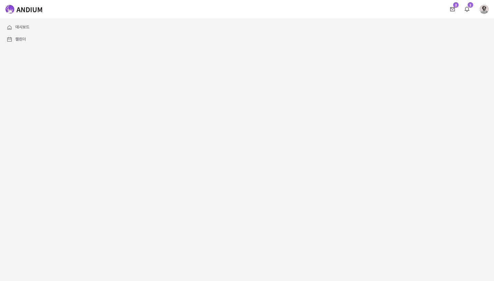
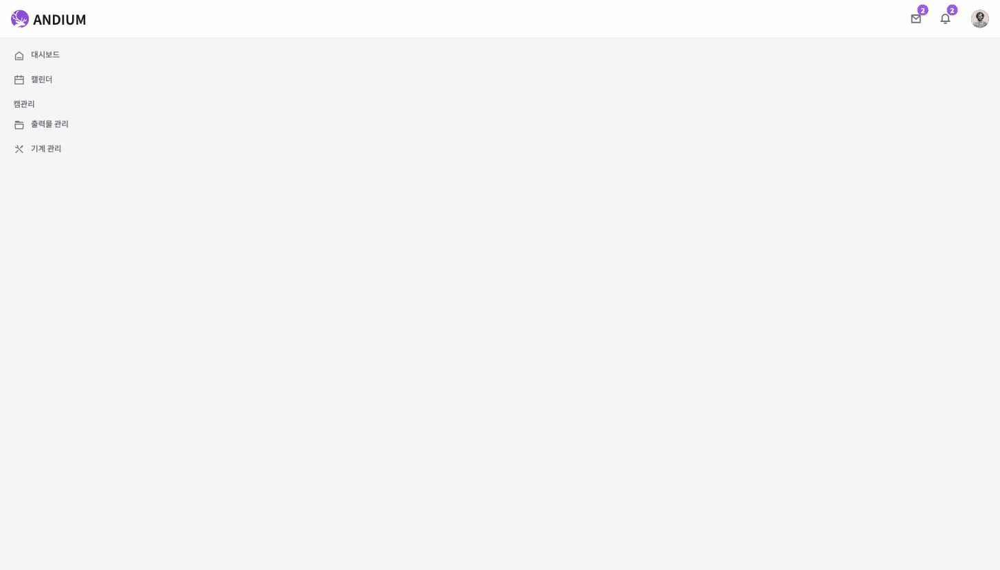

# role 이임 버그 수정 — UI 시연 결과

> 일시 2026-06-30 · 환경: 로컬 Chrome(Browser 1, macOS) · ToothFairy `localhost:5173` + 백엔드 `localhost:3000` + 소켓 `30090` + PostgreSQL
> 데모 계정: `demo_cam` (테스트용, 검증 후 삭제 예정)

## 시연 시나리오
회원가입한 사용자(역할 `user`)에게 어드민이 **CAM 권한(all_cam)을 이임**하면, 메뉴/권한이 실제로 바뀌는지 확인.

| 단계 | 조치 | 결과 |
|---|---|---|
| 1 | `demo_cam` 가입 → 승인(`isPermitted=true`) + 역할 `user`(roleId=4) | 로그인 성공 |
| 2 | 로그인 직후 사이드바 메뉴 | **대시보드, 캘린더** 만 (캠관리 없음) |
| 3 | 어드민이 역할을 `all_cam`(roleId=2)으로 이임 (DB) | — |
| 4 | 재로그인 | — |
| 5 | 재로그인 후 사이드바 메뉴 | **대시보드, 캘린더 + [캠관리] 출력물 관리, 기계 관리** ✅ |

### 메뉴 변화 (텍스트 증거)
```
BEFORE (role=user)              AFTER (role=all_cam)
─────────────────               ──────────────────────
• 대시보드                       • 대시보드
• 캘린더                         • 캘린더
                                 [캠관리]
                                 • 출력물 관리
                                 • 기계 관리
```
### 📷 시연 캡처 (`screenshots/` 폴더)
| BEFORE (역할 user) | AFTER (역할 all_cam) |
|---|---|
|  |  |

- `screenshots/1-role-user-before.png` — 대시보드·캘린더만
- `screenshots/2-role-allcam-after.png` — 캠관리(출력물 관리·기계 관리) 등장
- `screenshots/role-fix-before-after.gif` — 전환 애니메이션

## API 레벨 검증 (재로그인 없이 ≤15분 자동 반영 + 비활성화 로그아웃)
실제 수정 대상인 **리프레시 경로**를 직접 검증한 결과:
```
1) 회원가입               → 생성 완료(isPermitted=false)
2) 승인 + 역할 user(4)
3) 로그인                 → 토큰 role = [user]
4) DB에서 all_cam(2)로 이임
5) ★리프레시 호출★        → 토큰 role = [all_cam] ✅  (재로그인 없이 전환)
6) 계정 비활성화
7) 리프레시               → HTTP 401 ✅              (강제 로그아웃)
```
수정 전이라면 리프레시가 옛 토큰의 `user`를 그대로 복사했을 것 → 이제 DB 재조회로 `all_cam` 반영.

## 수정 내역 (이 시연으로 검증된 것)
- 백엔드 `AccessTokenController.refresh`: 옛 `userRole` 복사 → **DB에서 현재 역할 재조회**. 비활성화/삭제 계정은 401.
- 백엔드 roles 테이블에 **`all_lab` 추가**(기공소 사용자 배정용).
- 프론트 `PermissionService.canAccessPage`: **MENU_PERMISSIONS 단일 소스**로 통일(메뉴=진입권한 일치).
- 백엔드 dev **CORS**: 프론트 포트 변동(5173/5174 등)에도 통과하도록 dev 한정 모든 origin 허용.

## 재현 방법
1. 백엔드: `cd toothfairy-server && pnpm dev` (3000)
2. 소켓: `cd toothfairy-socket-server && pnpm dev` (30090)
3. 프론트: `cd toothfairy && pnpm dev` (5173)
4. 로컬 Chrome으로 `localhost:5173/login` 접속 → 위 1~5단계 수행
   (역할 변경은 어드민 UI `/setting/user` 또는 DB `UPDATE users SET "roleId"=2 WHERE email='...'`)
